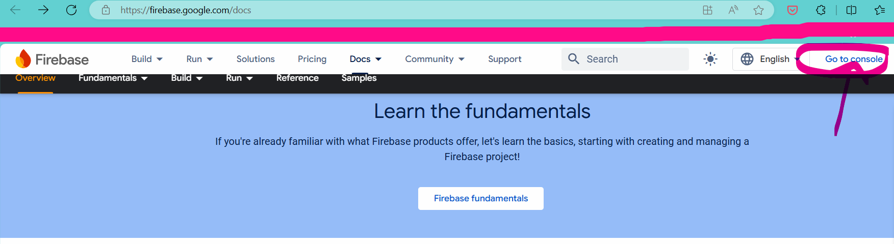
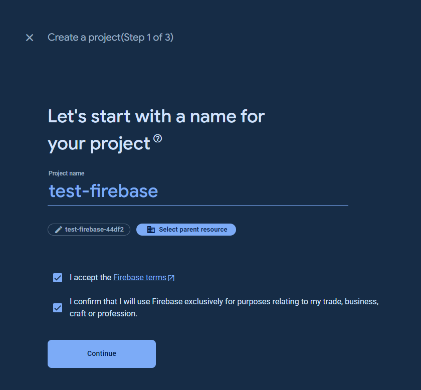
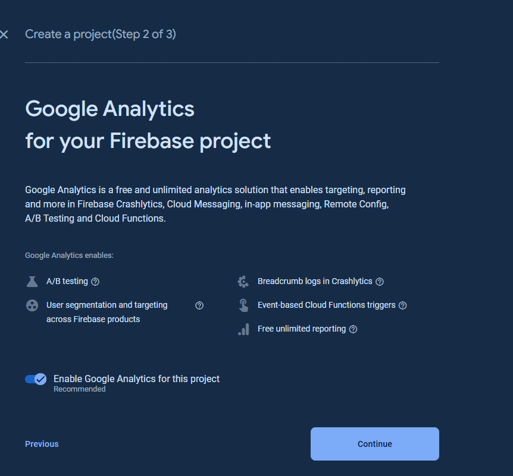
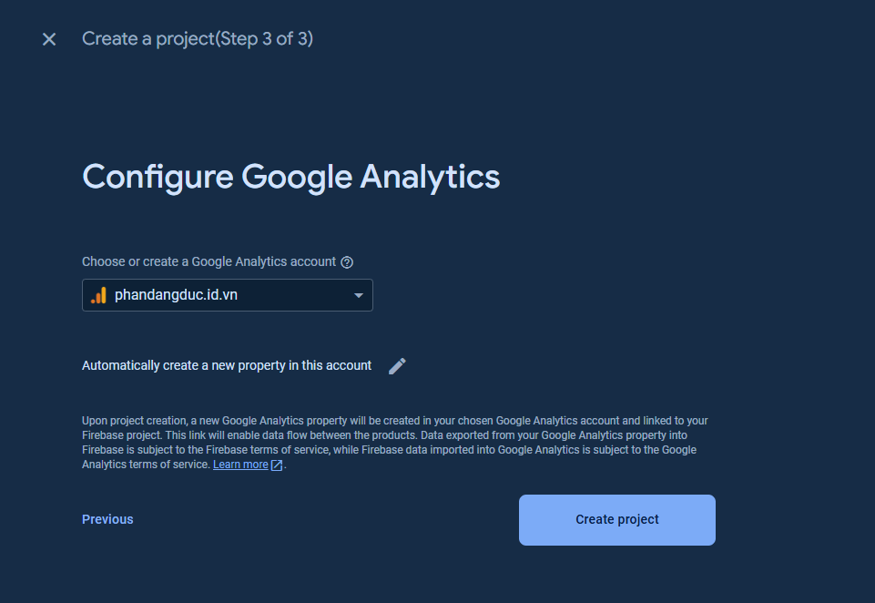
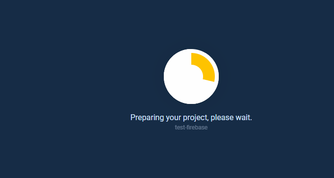

# Cách tạo 1  project với Firebase

### Vào trang [firebase](https://firebase.google.com/docs) --> chọn "Go to console":

### Chọn "Create a project":

### Điền tên project --> chấp nhận điều khoản của "Google" --> Chọn "continue"

### Chọn "continue"

### Chọn "account" cho "google analytics"

### Chờ Firebase tạo project

